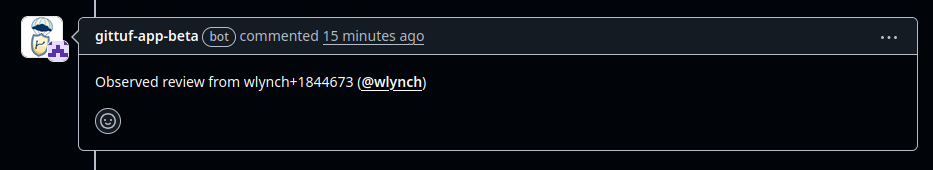

# Getting Started

## Installation

### Step 0: Decide functionality level

First, you'll need to decide on the level of functionality that you'd like to 
utilize from the app. There are two modes:

- **Lite mode**. If you'd like to simply have the app observe approvals on pull
  requests, then you can setup the app in _lite_ mode. The app records
  attestations for pull request approvals and merges, and can be used to
  generate source provenance attestations for the upcoming SLSA source track.
  The lite mode is recommended if you're interested in slowly ramping up with
  gittuf use.
- **Full mode**. If, instead, you'd like to use the information captured by the
  app to enforce a security policy, you'll need to set up the app in _full_
  mode. In this mode, the repository is configured with a specific policy. For
  example, you can configure the maintainers of the repository as approvers for
  changes, and validate the attestations recorded by the app against the policy
  to ensure the right approvals were issued.

The setup for both modes is identical until the app is installed on the 
repository. The guide will highlight where the installation process diverges.

### Step 1: Install the app

To install the app on your repository, visit the GitHub [marketplace
listing](https://github.com/apps/gittuf-app-beta). The UI will prompt you to
select which account to install the app under (e.g. under your personal account
or an organization), and for which repositories.

If you plan to use the app in lite mode, then you've finished setup! You can
skip down to [Step 3](#step-3-post-installation). If setting up the app in full
mode, proceed to step 2 below.

### Step 2: Setup full mode (if applicable)

#### Configuring gittuf to trust the GitHub app

First, initialize gittuf metadata on the repository following the [get started
guide](https://github.com/gittuf/gittuf/blob/main/docs/get-started.md) for
gittuf.

Next, authorize the GitHub app to record information in your repository by
running the following commands:

```bash
# Download the public key to verify app attestation signatures
curl -o /tmp/gittuf-app-key.pub https://raw.githubusercontent.com/gittuf/github-app/refs/heads/main/docs/hosted-app-key.pub
chmod 600 /tmp/gittuf-app-key.pub

# Specify the signing key that you previously configured as trusted for the root
# metadata
gittuf trust add-github-app -k <your signing key> --app-key /tmp/gittuf-app-key.pub

# Stage and apply the policy
gittuf policy stage --local-only
gittuf policy apply --local-only

# Push the gittuf policy
git push <remote name> refs/gittuf/*
```

NOTE: the app uses a fixed signing key. When the app's signing key is updated,
the gittuf metadata will also have to be updated with the new key.

### Step 3: Post-installation

Congrats! The app will now start listening for any pull requests on your
repository, and record any approvals or dismissal of approvals. Whenever either
of these events happen, the app will comment on the pull request, similar to
this:

[]()
