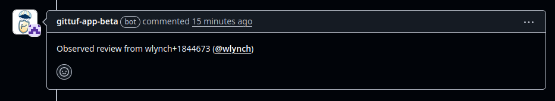

# Post Installation

Congrats! The app will now start listening for any pull requests on your
repository, and record any approvals or dismissal of approvals. Whenever either
of these events happen, the app will comment on the pull request, similar to
this:

If you opted to use gittuf in the full mode, proceed to [step
2](/docs/getting-started.md#step-2-setup-full-mode) of the installation. This
will walk you through configuring gittuf policy metadata to trust the app's
signing key.
